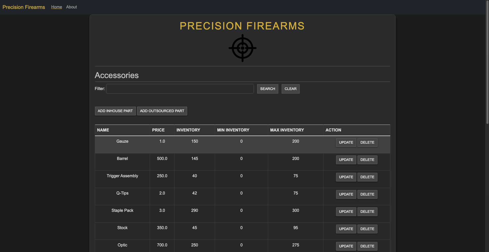
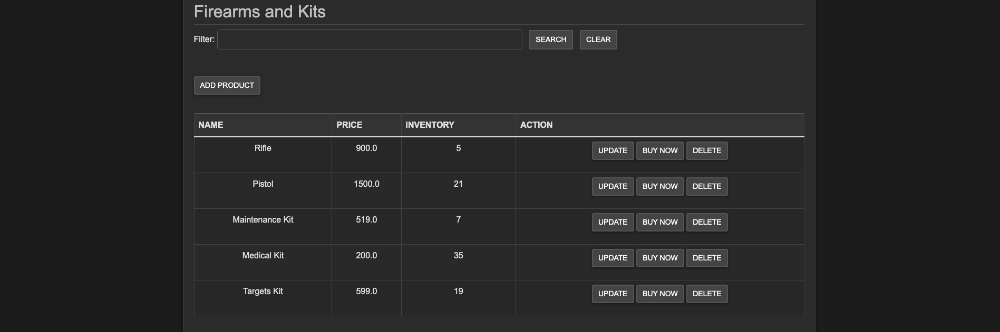
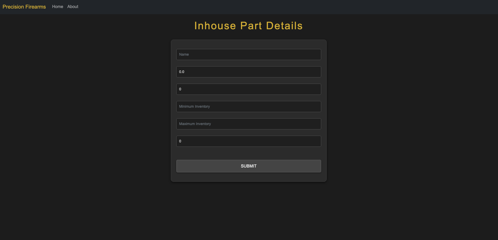
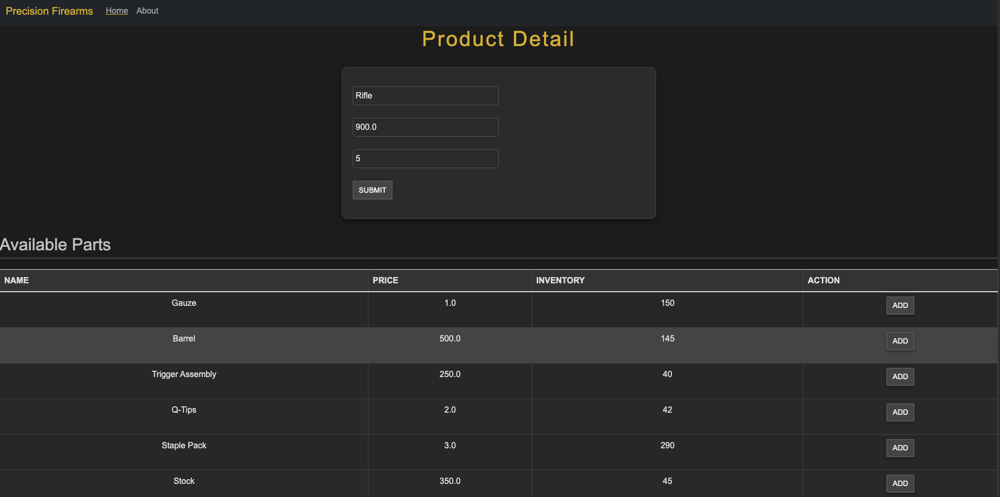
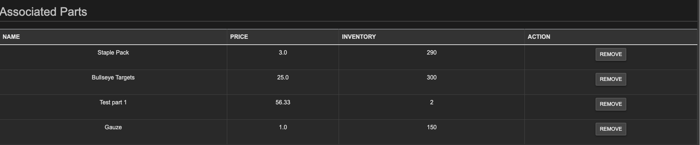
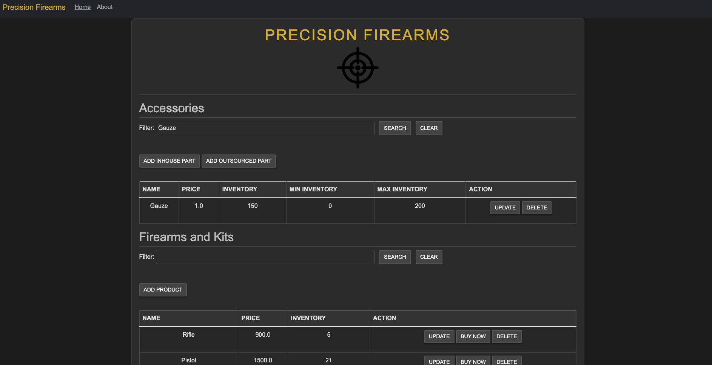
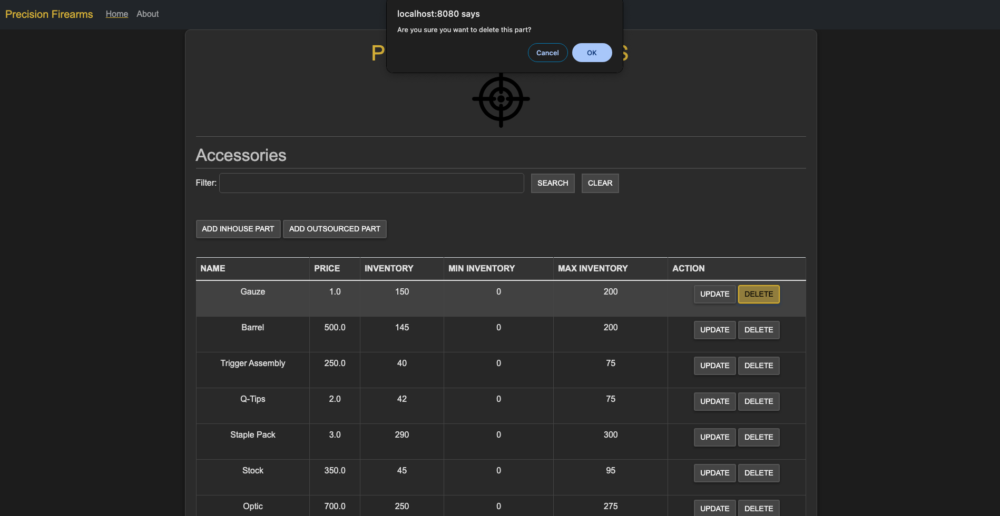
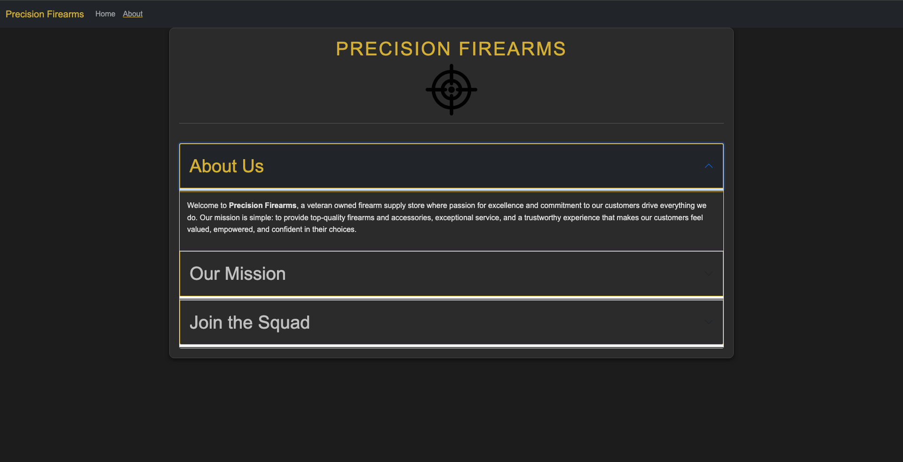
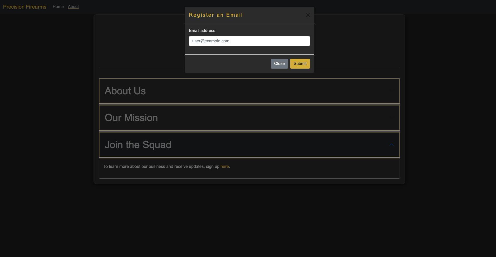

# D287 Java Frameworks: Trevor England

### Scenario
You are working for a company that licenses and customizes a software application to keep track of inventory in stores. Your job as a software developer is to customize this application to meet a specific customer’s needs. You will choose any type of customer you would like, but it must sell a product composed of parts.

The customer I have chosen for this project is a firearm store. The products a firearm store would sell could be various different types of guns, with the parts being individual components that customers can buy (whether it be for customization or maintenance). DISCLAIMER: This is not an intention to promote violence; rather I chose type of customer because it fulfills the requirements of the project and is something I enjoy doing in my personal time.

---

## Table of Contents

- [Installation](#installation)
- [Features](#features)
- [Code Changes](#code-changes)

---

## Installation

Follow these steps to set up the project locally:

1. Clone the repository:
   ```bash
   git clone https://github.com/TrevorEngland23/Precision-Firearms-Springboot

2. Navigate to the project directory:
   ```bash
   cd d287-java-frameworks

3. Open with Intellij, run application.

4. Open a web browser and navigate to http://localhost:8080.

---

## Features  

Upon initial load of the application, sample data is populated into the database. Feel free to delete this data and add your own.  

  
  

To add parts, click on *ADD INHOUSE PART* or *ADD OUTSOURCED PART*. Errors will occur if you do not set an inventory count, maximum and minimum inventory, or if your inventory count does not fall within those bounds. Similarly, you can add products by clicking *ADD PRODUCT*. 

  

Once you're satisfied with your parts and products, click on *UPDATE* next to one of your products. Here, you can associate parts with products. The system will not allow you to associate parts with a product if the assignment will violate the minimum inventory rules set for the associated part.  

  
  

Need to find a part or product from the system but don't want to scroll?  Use the filter feature on the mainscreen page to find the product.  

  

If you need to delete a product or part, simply click *DELETE*. This will prompt you with an alert to ensure you want to delete the item.  Similarly, you can buy a product by clicking the *BUY* button.  

  

Feel free to check out the **About** page. You can get there by clicking the *About* link in the navigation bar.  

  

While you're there, you can read about the company and their goals, as well as sign up for email alerts.  

  

---

## Code Changes

C. Customize the HTML user interface for your customer’s application. The user interface should include the shop name, the product names, and the names of the parts.

File: *mainscreen.html* | [Full Code](src/main/resources/templates/mainscreen.html)  
   **Line 14** -> linked new stylesheet to mainscreen.html (mainscreen.css)  
   **Line 16** -> Changed customer shop name to "Precision Firearms"  
   **Lines 19-33** -> Added BootStrap navigation bar for user experience (UX)  
   **Line 36** -> Changed default h1 to reflect the shop name (Precision Firearms)  
   **Line 37** -> Added svg for the company website  
   **Line 39** -> Replaced default parts with "Accessories"  
   **Lines 56,57,66,67** -> Added Max / Min inventory (from a later step)  
   **Line 71** -> Replaced default product with "Firearms and Kits"  
   **Line 108** -> Added buy now button (From a later step)  

File: *mainscreen.css*  | [Full Code](src/main/resources/static/css/mainscreen.css)  
   **Lines 1-159** -> Added file for styling mainscreen page.  

D.  Add an “About” page to the application to describe your chosen customer’s company to web viewers and include navigation to and from the “About” page and the main screen.  

File: *AboutController.java* | [Full Code](/src/main/java/com/example/demo/controllers/AboutController.java)  
   **Lines 1-13** -> Added controller for handling the route to the about page.   

File: *about.html* | [Full Code](/src/main/resources/templates/about.html)  
   **LINES 1-149** -> Added about page for customer software application.  

File: *about.css* | [Full Code](/src/main/resources/static/css/about.css)  
   **LINES 1-99** -> Added CSS file for the about page to match the theme of the application.  

E.  Add a sample inventory appropriate for your chosen store to the application. You should have five parts and five products in your sample inventory and should not overwrite existing data in the database.  

File: *BootStrapData.java* | [Full Code](/src/main/java/com/example/demo/bootstrap/BootStrapData.java)  
   **Lines 40-170** -> Added functionality to add 5 parts and 5 products of sample data upon initial start-up of application using constructors of part and product classes and putting the data into a HashSet.  

F.  Add a “Buy Now” button to your product list. Your “Buy Now” button must meet each of the following parameters:  
•  The “Buy Now” button must be next to the buttons that update and delete products.  
•  The button should decrement the inventory of that product by one. It should not affect the inventory of any of the associated parts.  
•  Display a message that indicates the success or failure of a purchase.  

File *mainscreen.html*  
   **Line 101** -> Added buy now button for successful purchases (as described above).  

File: *successfulpurchase.html* | [Full Code](/src/main/resources/templates/successfulpurchase.html)  
   **Lines 1-33** -> Added HTML page for successful purchases.  

File: *unsuccessfulpurchase.html* | [Full Code](/src/main/resources/templates/unsuccessfulpurchase.html)  
   **Lines 1-17** -> Added HTML page for unsuccessful purchases.  

File: *BuyNowController* | [Full Code](/src/main/java/com/example/demo/controllers/BuyNowController.java)  
   **Lines 1-31** -> Added a controller for the buyNow webpage. Ensures that a product out of stock cannot be purchased, and any product that is purchased is decremented in quantity by 1.  

File: *successfulpurchase.css* | [Full Code](src/main/resources/static/css/successfulpurchase.css)  
   **Lines 1-34** -> Added a style sheet to match the theme of the application for successpurchase.html  

File: *unsuccessfulpurchase.html* | [Full Code](src/main/resources/static/css/unsuccessfulpurchase.css)  
   **Lines 1-34** -> Added a style sheet to match the theme of the application for unsuccessfulpurchase.html  

G.  Modify the parts to track maximum and minimum inventory by doing the following:  
•  Add additional fields to the part entity for maximum and minimum inventory.  
•  Modify the sample inventory to include the maximum and minimum fields.  
•  Add to the InhousePartForm and OutsourcedPartForm forms additional text inputs for the inventory so the user can set the maximum and minimum values.  
•  Rename the file the persistent storage is saved to.  
•  Modify the code to enforce that the inventory is between or at the minimum and maximum value.

File: *Part.java* | [Full Code](src/main/java/com/example/demo/domain/Part.java)  
   **Lines 29-34** -> Added Integer values for min/max inventory. Also creates columns in the database.  
   **Lines 58-65** -> Created a new constructor to handle all entities.  
   **Lines 99-111** -> Created getters & setters for max/min inventory.  
   **Lines 115-130** -> Created a method isValid() that checks for specific invalid inventory rules, and throws the proper exception gracefully depending on which rule was violated (Part of later requirement).  

File: *BootStrapData.java*  
   **Lines 64,65.72,73,80,81,88,89,96,97,105,106,114,115,123,124,132,133,141,142,150,151** -> Used Setter methods for each max/min part.  
   **Lines 47-51** -> Used the constructor made as referenced above.  

File: *InhousePartForm.html* | [Full Code](src/main/resources/templates/InhousePartForm.html)  
   **Lines 15-29** -> Added BootStrap navbar.  
   **Lines 45-48** -> Added text inputs for the in-house part inventory so users can set the minimum and maximum values for each part.  
   **Lines 54,55** -> Added centralized location for error messages to occur.  

File: *OutsourcedPartForm.html* | [Full Code](src/main/resources/templates/OutsourcedPartForm.html)  
   **Lines 13-27** -> Added BootStrap navbar.
   **Lines 44-47** -> Added text inputs for the outsourced part inventory so users can set the minimum and maximum values for each part.  
   **Lines 52,53** -> Added centralized location for error messages to occur.  

File: *application.properties* | [Full Code](src/main/resources/application.properties)  
   **Line 6** -> Updated the url to the database to *jdbc:h2:~/precision-firearms-db*.  

File: *Part.java*  
   **Lines 119-130** -> Added a method isValid() that enforces logical rules on the minimum and maximum values. Throws an exception in the event a rule is broken. (As described above)  

File: *AddOutsourcedPartController.java* | [Full Code](src/main/java/com/example/demo/controllers/AddOutsourcedPartController.java)  
   **Lines 36-50** -> Changed the @PostMapping logic to enforce the use of the isValid() method defined in Part.java.  

File *AddInhousePartController.java* | [Full Code](src/main/java/com/example/demo/controllers/AddInhousePartController.java)  
   **Lines 36-50** -> Changed the @PostMapping logic to enforce the use of the isValid() method in Part.java.  

Files *updateprod.css* | [Full Code](src/main/resources/static/css/updateprod.css), *productform.css* | [Full Code](src/main/resources/static/css/productform.css)  
   **Lines 1-139**, **1-179** (respectively) -> Added stylesheets to fit the theme of the application.  

File: *mainscreen.html*  
   **Lines 56-57** -> Added the Min Inventory and Max Inventory table headings. (As referenced above)  

H.  Add validation for between or at the maximum and minimum fields. The validation must include the following:  
•  Display error messages for low inventory when adding and updating parts if the inventory is less than the minimum number of parts.  
•  Display error messages for low inventory when adding and updating products lowers the part inventory below the minimum.  
•  Display error messages when adding and updating parts if the inventory is greater than the maximum.  

File: *Part.java*  
   **Lines 117-129** -> Added multiple checks to enforce the minimum and maximum values are set, and inventory must fall within the range of minimum and maximum values. (As referenced above)  

File: *AddPartController.java* | [Full Code](src/main/java/com/example/demo/controllers/AddPartController.java)  
   **Lines 59-75** -> Replaced logic for updatePart to save the part and update partService and display a confirmation page if no exceptions are thrown, otherwise return the form back.  

File: *AddProductController.java* | [Full Code](src/main/java/com/example/demo/controllers/AddProductController.java)  
   **Lines 32-35** -> Added private fields partService and partRepository
   **Lines 76-108** -> Added logic to the submitForm method that handles the logic for adding / updating products IF the associated parts inventory for that product allows for it. Added additional error messages for if a user requests an increase in the number of product that will cause the associated part to fall into the negative numbers. If the part inventory supports the request, the user should be allowed to update / add their product, which will decrement  
                        the part inventory by the amount of products requested.  

I.  Add at least two unit tests for the maximum and minimum fields to the PartTest class in the test package.  

File: *PartTest.java* | [Full Code](src/test/java/com/example/demo/domain/PartTest.java)  
   **Lines 161-196** -> Added unit tests (assertEquals) on get/set max and min inventory.  

File: *AddProductController.java*  
   **Lines 104-108** -> Fixed logic to where if a user DECREMENTS a product in the update section, the associated part does not also decrement. Logically, parts should only be decrementing if MORE products are being added in, not if the product needs to be decremented for some reason. (As referenced above)  

J.  Remove the class files for any unused validators in order to clean your code.  

Removed the validator for **delete price** as I have my own implementation elsewhere.  

*Will go through code to remove class files and clean up extra whitespace in code*  


K.  Demonstrate professional communication in the content and presentation of your submission.  

**Of Note:**  
Some files, such as the HTML and CSS files, I have modified throughout the development process. To keep things simple, the general changes for these files include adding a bootstrap navigation bar to each html file. Additionally, the "<a href="http://localhost:8080/mainscreen">Back to mainscreen</a>" element is either in the navigation bar at "Home" or included in the original place.  


